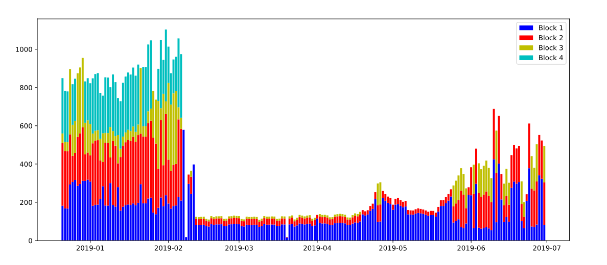

# Powerplant constraints forecast with Machine Learning

## Table of contents
* [General info](#general-info)
* [Technologies](#technologies)

## General info
This project aims at forecasting powerplant energy constrains, i.e. minimum energy and maximum power / energy based on historical data using machine learning techniques.

This is a multivariate regression problem whose predictions must respect a number of constrains, which makes it unusual and challenging.
	
## Technologies
Project is implemented in Jupyter notebooks using Python.
	

